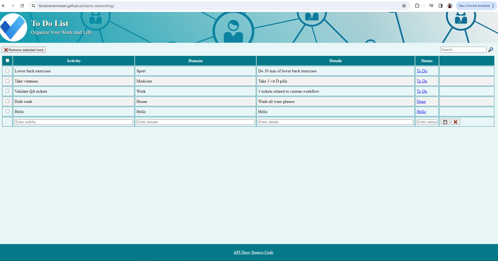

# To Do List

# 💠 Features & Usage

```
To Do List (CRUD) Operations
- Create
- Read
- Update
- Delete
Search
Loading mask
```

# Preview



# 📋 Steps to create this project

- create New repository in github/new
- check Add a README file
- Add .gitignore (Node template)
- clone it on your pc
- create index.html file with standards
- create table that represents final desing and structure

  # 🧩 Connect with API

  Current app can connect with external node-API to store it's data.

- Clone & Start teo-api
- From current UI make request to teo-api (using json or mysql url)
